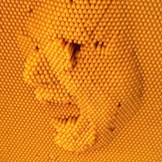

# Frank's Website

## About the author
My name is Frank Aalbers and I'm a Maker and coding newb interested in Robotics, Electronics , Drones and coding
I'm creating this repo to learn GitHub
# My Projects
Here is a list of projects that I have been working on
# My Interests
I'm interested in Robotics, Automation, Artificial Intelligence, Drones and many
other technical topics.
# My Blog
I'm really excited to blog my journey on Github.com
<ul>
  
    <li>
      <a href="{{ post.url }}">{{ post:title }}</a>
    </li>
  
</ul>

# Get in Touch
<ul>
  <li>
    <a href="https://github.com/{{ site.github_username}}">GitHub</a>
  </li>
</ul>
